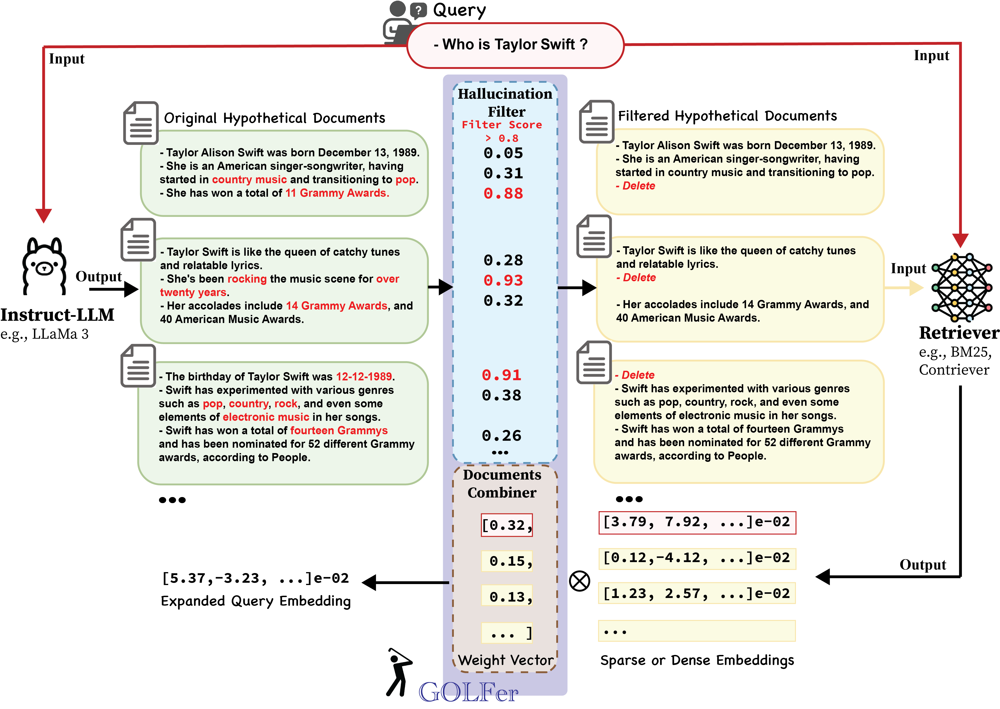

## GOLFer: Smaller LM-Generated Documents Hallucination Filter & Combiner for Query Expansion in Information Retrieval

**📢 News: this work has been accepted at the ACL 2025 findings!**

This is code repository for the paper: [GOLFer: Smaller LM-Generated Documents Hallucination Filter & Combiner for Query Expansion in Information Retrieval](https://arxiv.org/abs/2506.04762).

GOLFer: Smaller LMs-Generated Document Hallucination Filter & Combiner — A novel method that leverages smaller open-source LMs for query expansion. GOLFer comprises two modules: a hallucination filter and a documents combiner. The former detects and removes non-factual and inconsistent sentences in generated documents, a common issue with smaller LMs, while the latter combines the filtered content with the query using a weight vector to balance their influence. 




## 1 Requirements

```bash
pip install transformers==4.30.2
pip install beir==1.0.1
pip install datasets==2.14.1
pip install tqdm
pip install scipy
pip install evaluate==0.2.2
pip install spacy==3.7.2
pip install accelerate
pip install elasticsearch==7.17.9
pip install pyserini
pip install fassi-cpu
pip install numpy
pip install nltk
```
or
```bash
bash install.sh
```


## 2 Resourse
### 2.1 Prebuilt faiss index

Install [pyserini](https://github.com/castorini/pyserini#-installation) and download the [prebuilt faiss index](https://github.com/castorini/pyserini/blob/master/docs/prebuilt-indexes.md) for 'msmarco-v1-passage.ance','msmarco-v1-passage.aggretriever-cocondenser','msmarco-v1-passage.aggretriever-distilbert','msmarco-v1-passage.tct_colbert-v2'. We use pyserini to conduct retrieval and evaluation. 
### 2.2 Hypothesis Documents
We provide example hypothesis documents generated using 'llama3-8b-instruct' in the following directory:

*TREC DL19 data/hypothesis_documents_dl19*

Additionally, we include the corresponding filtered hypothesis documents (processed using GOLFer) in:

*TREC DL19 data/hypothesis_documents_dl19_qualified*

You can generate these filtered documents by running the Jupyter Notebook:

*TREC DL19 data/GLOFer-demo-dl19-filter.ipynb*

## 3 Run

Run 'GOLFer-demo-dl19.ipynb', it will run the experiments for GOLFer on the TREC DL19 dataset in five embeddings.

## Citation

```
@misc{liu2025golfersmallerlmgenerateddocuments,
      title={GOLFer: Smaller LM-Generated Documents Hallucination Filter & Combiner for Query Expansion in Information Retrieval}, 
      author={Lingyuan Liu and Mengxiang Zhang},
      year={2025},
      eprint={2506.04762},
      archivePrefix={arXiv},
      primaryClass={cs.IR},
      url={https://arxiv.org/abs/2506.04762}, 
}
```


